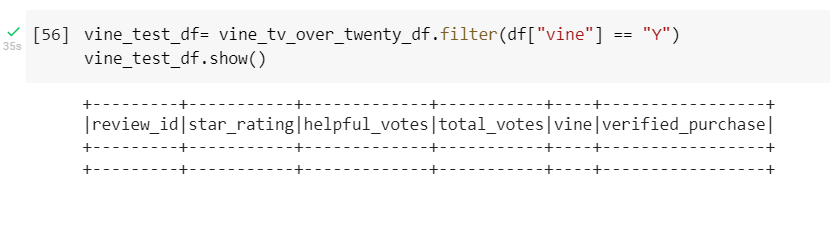

# Amazon Vine Analysis
Amazon Vine invites the most trusted reviewers on Amazon to post opinions about products to help their fellow customers make informed purchase decisions.  
Vine reviews are the independent opinions of the Vine Voices, and the selling partners cannot influence, modify or edit the reviews.

## Overview of the analysis of the Vine program
#### File used: Digital EBooks : [https://s3.amazonaws.com/amazon-reviews-pds/tsv/amazon_reviews_us_Digital_Ebook_Purchase_v1_01.tsv.g] from [https://s3.amazonaws.com/amazon-reviews-pds/tsv/index.txt]

This program is analyzing Amazon reviews written by members of the paid Amazon Vine program to determine if there is any bias toward favorable reviews from Vine members in your dataset.
Unfortunately, the dataset isn't containing Vine program reviews.  Therefore, only available for NON-VINE program reviews. 

#### Technology used: The project initiated with PySpark to perform the ETL process to extract the dataset, transform the data, connect to an AWS RDS instance, 
and load the transformed data into pgAdmin

In pgmAdmin using Table SQL, created necessary fields to adopt cleaned data from the Google CoLab. 
Once the dataset is cleaned and extracted, we stored the needed data in the pgmAdmin through AWS S3 bucket (RDS). Then the data is analyzed.  Once retrieved cleaned data, 
the result showed that there isn't any vine invited reviewers. Therefore, this project only evaluated non-vine reviews only. 

## Amazon Vine Analysis Results:
#### VINE Review Analysis result :
- The total number of vine reviews = 0
- The number of 5-star of vine reviews = 0

#### NON-VINE Review Analysis result :
- The total number of vine not paid reviews = 60647
- The number of 5-star of non-Vine reviews = 22843
- The number of 5-star of non-Vine reviews = 37.67%

## Amazon Vine Analysis Summary:
As a result, we concluded that as far as the EBooks are concerned there weren’t any vine reviewers recorded, therefore no bias was found.  

